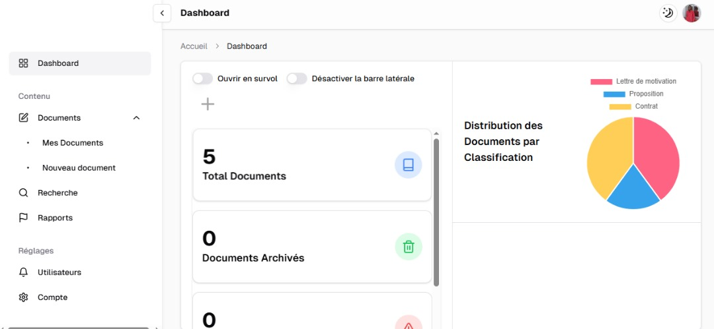

# YunoDoc - Electronic Document Management Application (EDMS)

**YunoDoc** is a modern Electronic Document Management System (EDMS) designed to automate document uploading, classification, search, and tracking for organizations. Built with **Next.js**, **Drizzle ORM**, **Neon (PostgreSQL)**, **Firebase**, and **Tailwind CSS**, it offers a fast and efficient user experience for managing business documents.


## 🚀 Features

- 📁 Upload PDF documents with AI-based auto-classification
- 🔎 Smart content search (OCR + embeddings)
- 🗂️ Automatic folder organization
- 👥 User and role management
- 📊 Dashboard with activity logs
- 🔐 Secure authentication via Firebase Auth
- ☁️ File storage using Firebase Storage

## 🧰 Tech Stack

- **Frontend**: Next.js, TypeScript, Tailwind CSS, Shadcn UI
- **Backend**: Next.js API Routes / Edge Functions
- **Database**: Neon + Drizzle ORM
- **Storage & Auth**: Firebase (Auth, Firestore, Storage)
- **AI/OCR**: Tesseract.js, Google Generative AI

## 📦 Installation

```bash
git clone https://github.com/jeremi-24/ged.git
cd yunodoc
npm  install
cp .env.example .env.local
npm run  dev
